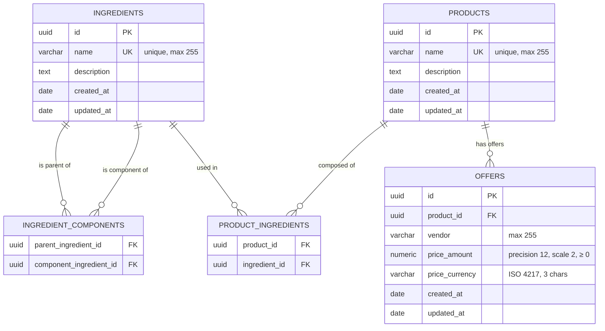

# Market — Business / Domain Model

## Domain Overview

The market context manages two aggregate roots — **Ingredient** and **Product** — plus the **Offer** entity and the **Price** value object.

| Concept | Role |
|---|---|
| `Ingredient` | Aggregate root. Catalog entry for a raw ingredient. Self-composable (an ingredient can be made of other ingredients). |
| `Product` | Aggregate root. A sellable product referencing a set of ingredients. Owns its price offers. |
| `Offer` | Entity inside the Product aggregate. Represents one vendor's current price for a product. Identity through `(productId, vendor)` uniqueness. |
| `Price` | Value object. An immutable, validated `(amount, currency)` pair. No identity — equality is structural. |

---

## UML Class Diagram — DDD View

> Stereotypes: `«AR»` = Aggregate Root · `«E»` = Entity · `«VO»` = Value Object · `«JE»` = Join Entity (no standalone identity)
> Composition (`*--`) = lifecycle owned by parent. Reference (`-->`) = cross-aggregate, by UUID only.

```mermaid
classDiagram
  direction TB

  %% ── Ingredient Aggregate ──────────────────────────────────────────────────
  class Ingredient {
    «AR»
    +UUID id
    +string name  [unique]
    +string? description
    +date createdAt
    +date updatedAt
  }

  class IngredientComponent {
    «JE»
    +UUID parentIngredientId  [FK]
    +UUID componentIngredientId  [FK]
  }

  Ingredient "1" *-- "0..*" IngredientComponent : parent ▶
  IngredientComponent "0..*" --> "1" Ingredient : ▶ component

  %% ── Product Aggregate ─────────────────────────────────────────────────────
  class Product {
    «AR»
    +UUID id
    +string name  [unique]
    +string? description
    +date createdAt
    +date updatedAt
  }

  class Offer {
    «E»
    +UUID id
    +UUID productId  [FK]
    +string vendor
    +date createdAt
    +date updatedAt
    -- unique: (productId, vendor) --
  }

  class Price {
    «VO»
    +number amount  [≥ 0]
    +string currency  [ISO 4217]
    +create(data)$ Price
    +toString() string
    -- equality: structural --
  }

  class ProductIngredient {
    «JE»
    +UUID productId  [FK]
    +UUID ingredientId  [FK]
  }

  Product "1" *-- "0..*" Offer : offers ▶
  Offer *-- "1" Price : price ▶
  Product "1" *-- "0..*" ProductIngredient : composition ▶
  ProductIngredient "0..*" ..> "1" Ingredient : ref (cross-aggregate, UUID only)
```



---

## Entity-Relationship Diagram — Relational View



---

## Aggregate Boundary Rules

```
┌─── Ingredient Aggregate ──────────────────────────────────┐
│  Ingredient (root)                                         │
│    └── IngredientComponent (join, no standalone identity)  │
└────────────────────────────────────────────────────────────┘

┌─── Product Aggregate ──────────────────────────────────────┐
│  Product (root)                                            │
│    ├── Offer (entity, lifecycle tied to Product)           │
│    │     └── Price (value object, embedded in Offer)       │
│    └── ProductIngredient (join; ingredientId = UUID ref)   │
└────────────────────────────────────────────────────────────┘
         │ cross-aggregate reference (UUID only)
         ▼
    Ingredient Aggregate
```

- **No navigation from Ingredient to Product** — the association is owned by the Product aggregate.
- **Offer is never queried in isolation** — always through Product.
- **Cross-aggregate reference is a plain UUID** — `ProductIngredient.ingredientId` is not a domain object.
- **Price has no identity** — two `Price(9.99, EUR)` instances are equal; it is always embedded in an `Offer`.

---

## Invariants & Constraints

| Rule | Where enforced |
|---|---|
| `Ingredient.name` is unique | DB unique constraint + Drizzle schema |
| `Product.name` is unique | DB unique constraint + Drizzle schema |
| One offer per `(product, vendor)` | DB unique constraint `offers_product_vendor_unique` — handler uses upsert |
| `Price.amount ≥ 0` | `Price.create()` validates via Zod |
| `Price.currency` is exactly 3 chars | `Price.create()` validates via Zod |
| Deleting an Ingredient cascades to `ingredient_components` and `product_ingredients` | `ON DELETE CASCADE` on FKs |
| Deleting a Product cascades to `product_ingredients` and `offers` | `ON DELETE CASCADE` on FKs |
